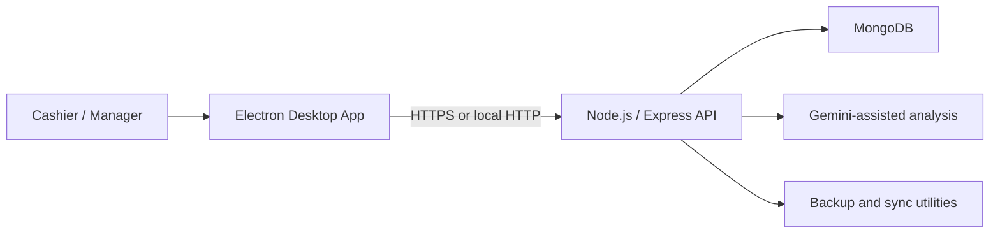

# Fashion Shaa POS

A Windows-oriented point-of-sale and retail operations system developed for use in a real clothing shop.

Fashion Shaa combines an Electron desktop client with a Node.js/Express API and MongoDB. The project covers everyday cashier workflows as well as inventory, staff, customer, supplier, reporting, barcode, synchronization, backup, and AI-assisted analysis features.

> **Project status:** Actively developed and used as a practical retail system. This repository demonstrates a substantial working implementation, but it is not presented as production-certified software. Transaction integrity, recovery verification, test isolation, deployment automation, and operational monitoring remain active engineering priorities.

## Key capabilities

### Point of sale

- Product search and barcode-assisted item entry
- Cart calculation, discounts, checkout, and receipt printing
- Sales records, returns, and historical lookup
- Shift and cashier workflows

### Store operations

- Inventory and item management
- Employees, attendance, roles, and advances
- Customer records
- Suppliers and purchase orders
- Discount rules and stock movement support
- Daily, monthly, and operational reporting

### Analysis and automation

- Sales analysis endpoints
- Employee-performance analysis
- Discount advice
- Restocking predictions
- Barcode parsing, generation, assignment, and rendering

AI-assisted features require a separately configured Gemini API key and should be treated as decision support rather than autonomous business decisions.

### Reliability and administration

- JWT authentication and role-based API authorization
- API rate limiting
- Database health reporting
- Local/remote MongoDB connection modes
- Manual or scheduled database synchronization
- MongoDB backup and restore utility
- Windows installer and portable application build targets

## Architecture



The Electron client communicates with the backend through authenticated REST endpoints. The API centralizes authentication, items, sales, returns, employees, customers, suppliers, discounts, barcodes, analysis, and synchronization.

## Technology stack

| Layer | Technologies |
|---|---|
| Desktop client | Electron, HTML, JavaScript, Tailwind CSS |
| Backend | Node.js, Express 5 |
| Database | MongoDB, Mongoose |
| Security | JWT, bcryptjs, role-based authorization, rate limiting |
| AI assistance | Google Generative AI |
| Testing | Jest, jsdom, Playwright, custom parser/integration scripts |
| Packaging | electron-builder, NSIS, portable Windows target |
| Deployment support | Render blueprint, HTTPS API configuration, health endpoint |

## Repository structure

```text
POS-
├── pos-main/
│   ├── backend/
│   │   ├── middleware/
│   │   ├── migrations/
│   │   ├── models/
│   │   ├── routes/
│   │   ├── tests/
│   │   ├── backup.js
│   │   ├── server.js
│   │   └── package.json
│   ├── simple-pos/
│   │   ├── js/
│   │   ├── tests/
│   │   │   ├── unit/
│   │   │   └── e2e/
│   │   ├── main.js
│   │   ├── preload.js
│   │   └── package.json
│   ├── DEPLOYMENT.md
│   └── render.yaml
└── README.md
```

## Local development

### Requirements

- Node.js and npm
- MongoDB running locally, or a MongoDB connection string
- Windows for the intended desktop experience
- MongoDB Database Tools for backup and restore commands

### 1. Clone the repository

```bash
git clone https://github.com/kaushalye1234/POS-.git
cd POS-/pos-main
```

### 2. Configure the backend

Create `backend/.env`:

```env
PORT=5000
NODE_ENV=development
MONGO_URI=mongodb://127.0.0.1:27017/fashion_shaa_pos
JWT_SECRET=replace-with-a-long-random-secret
JWT_EXPIRY=12h
CORS_ORIGIN=
GEMINI_API_KEY=
```

Never commit real credentials or production secrets.

The backend also supports separate `MONGO_LOCAL_URI`, `MONGO_REMOTE_URI`, and `MONGO_CONNECTION_MODE` settings for local, remote, or automatic connection selection.

### 3. Start the backend

```bash
cd backend
npm install
npm start
```

Verify readiness:

```text
GET http://localhost:5000/api/health
```

A healthy response requires a working MongoDB connection.

### 4. Start the Electron application

Open a second terminal:

```bash
cd pos-main/simple-pos
npm install
npm start
```

The API address can be configured from the desktop application. Local APIs may use `http://localhost`; hosted APIs are expected to use HTTPS.

## Testing

Run cashier unit tests:

```bash
cd pos-main/simple-pos
npm run test:unit
```

Run Playwright tests:

```bash
npm run test:e2e
```

Run backend parser tests:

```bash
cd ../backend
npm run test:parser
```

The backend integration test scripts can modify database state. Use only an isolated disposable test database—never a shop or production database.

## Build the Windows application

```bash
cd pos-main/simple-pos
npm run build:electron
```

The Electron configuration supports NSIS installer and portable Windows targets.

## Backup and restore

The backend includes a MongoDB utility:

```bash
cd pos-main/backend

# Create a backup
node backup.js

# List backups
node backup.js --list

# Restore the latest backup
node backup.js --restore latest
```

Restore uses `mongorestore --drop` and can overwrite existing data. Test recovery against a safe database before relying on it operationally.

## Security notes

- Protected API routes require JWT authentication.
- Administrative operations use role checks.
- Passwords are hashed with bcryptjs.
- CORS origins and token lifetime are configurable.
- Hosted API addresses must use HTTPS in the desktop client.
- Replace the development JWT default with a strong environment secret.

## Current engineering priorities

- Strengthen transaction safety across sales and stock updates
- Expand automated API and end-to-end coverage
- Isolate destructive integration tests
- Verify backup restoration and failure recovery
- Add CI/CD, dependency scanning, and container scanning
- Add structured logging, metrics, and alerting
- Standardize repeatable releases and deployment documentation

## Author

Developed by **Chamindu Kaushalya**, a Software Engineering undergraduate at SLIIT, as a long-term practical project spanning retail software, backend engineering, testing, and operational reliability.

- **LinkedIn:** [Chamindu Kaushalya](https://lnkd.in/p/gbiN_W8j)
